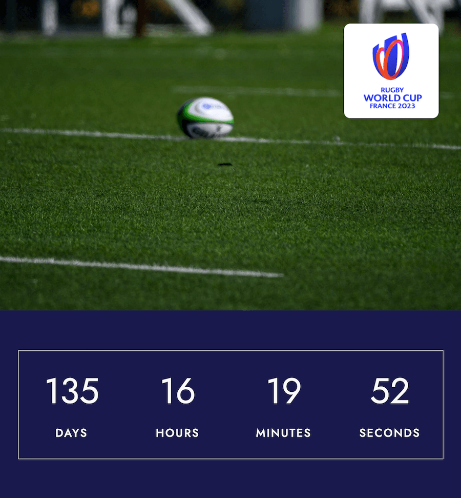
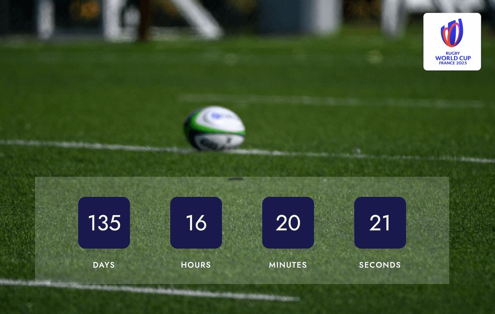

# RWC Countdown Timer with Vue CLI, Webpack and SASS

<div align="center">
  <picture>
    <source media="(max-width: 1199px)" srcset="./src/assets/countdown-mobile.png"/>
    <source media="(min-width: 1200px)" srcset="./src/assets/countdown-desktop.png"/>
    
  </picture>
  <p>Rugby World Cup Countdown Timer</br><em><small>(if viewing on desktop, resize the browser window to see the mobile version)</small></em></p>
</div>

</br>

## Table of contents

- [Tools](#tools)
- [Overview](#overview)
  - [Links](#links) 
  - [Highlights](#highlights)
- [Build details](#build-details)
  - [Features](#features)
  - [What I learned](#what-i-learned)
- [Author](#author)

</br>

## Tools

- Vue.js
- Webpack
- Babel
- ESLint
- SASS

</br>

## Overview

For this project, I created a countdown timer using Vue CLI, Webpack and SASS. The timer counts down until the opening match (on 8 September) of Rugby World Cup 2023, which will be held in France from 8 September to 28 October.

My build needed to fulfill the following:

- mobile-first design
- creating a countdown based on today's date and the start date of Rugby World Cup

</br>

### Links

View live page: [Vue.js Countdown Timer](https://rileydevdzn.github.io/vue-rwc-countdown/)

</br>

### Highlights

- Mobile-first design
  - [Shifting layouts from mobile to desktop](#mobile-first-design)
- Creating a countdown
  - [Creating a countdown](#creating-a-countdown)

</br>

## Build details

### Features

#### *Mobile-first design*

For this project, I wanted to keep the focus on the countdown timer so I used a simple design with a photo of a rugby pitch and ball, along with matching the RWC color scheme. I also included a clickable icon that takes the user to the official Rugby World Cup 2023 website. 

I started with the mobile design, taking advantage of the vertical space to create a vertical stacked version of the countdown.

</br>

<div align="center">
  
  <p><em>Mobile version</em></p>
</div>

</br>

For the tablet design, with an increased viewport width, I shifted the layout to a horizontal side-by-side countdown with a minimalist boxed design.

</br>

<div align="center">
  
  <p><em>Tablet version</em></p>
</div>

</br>

For the desktop design, I overlaid the horizontal countdown timer over the photo of the rugby pitch and gave each category (days, hours, minutes, seconds) its own styled container.

</br> 

<div align="center">
  
  <p><em>Desktop version</em></p>
</div>

</br>

#### *Creating a countdown*

My first step in creating the timer was to calculate the time remaining using the JavaScript `date` object, where my `nowDate` represented today's date and my `endDate` represented the RWC opening match date. I originally hardcoded the end date, then later refactored this to include an updatable version where the values could be changed from the main App.vue, using props and computed values. 

```js
const nowDate = new Date();
// hardcoded version...const endDate = new Date(2023, 8, 8, 21, 15, 0);
let distance = this.endDate.getTime() - nowDate.getTime();
```

Next, I needed to format the days, hours, minutes, and seconds values. I used computed values along with `Math.floor()` to avoid writing out the calculations repeatedly.

```js
export default {
  computed: {
    secondsCalc: () => 1000,
    minutesCalc() {
      return this.secondsCalc * 60
    },
    hoursCalc() {
      return this.minutesCalc * 60
    },
    daysCalc() {
      return this.hoursCalc * 24
    },
    // ...
  },
  methods: {
    // ...
    const days = Math.floor((distance / this.daysCalc));
    const hours = Math.floor((distance % this.daysCalc) / this.hoursCalc);
    const minutes = Math.floor((distance % this.hoursCalc) / this.minutesCalc);
    const seconds = Math.floor((distance % this.minutesCalc) / this.secondsCalc);
    // ...
  }
}
```

Then I adjusted the format so that single digits included a leading zero, and finally displayed the data.

```js
export default {
  methods: {
    formatDigit: digit => (digit < 10 ? "0" + digit : digit),
    // ...
    showRemaining() {
      // ...
      this.displaySeconds = this.formatDigit(seconds);
      this.displayMinutes = this.formatDigit(minutes);
      this.displayHours = this.formatDigit(hours);
      this.displayDays = this.formatDigit(days);
    },
  },
}
```

</br>

### What I learned

#### *JavaScript `date` object*

I learned a lot about working with dates and times in JavaScript through this project. I was also able to practice refactoring my code to better adhere to DRY principles for repeated calculations.

</br>

#### *Using v-if with component states*

In the completed the countdown timer, I noticed that there was a flash of zeros when the page was first pulled up or refreshed. After doing some research, I figured out I could use `v-if` on the component's load state to ensure the timer didn't display until the page was loaded. This gives a slight pause before the timer displays on load, but was more desirable than the flash of zeros. 

I also added a parent container with `v-if` to the countdown timer, along with a sibling `v-else` for when the timer reaches zero, that will display the message "It's Time!" and a link to the match schedule on the official RWC 2023 website when the countdown expires.

</br>

## Author

- Riley - [View Portfolio](https://rileydevdzn.webflow.io)
