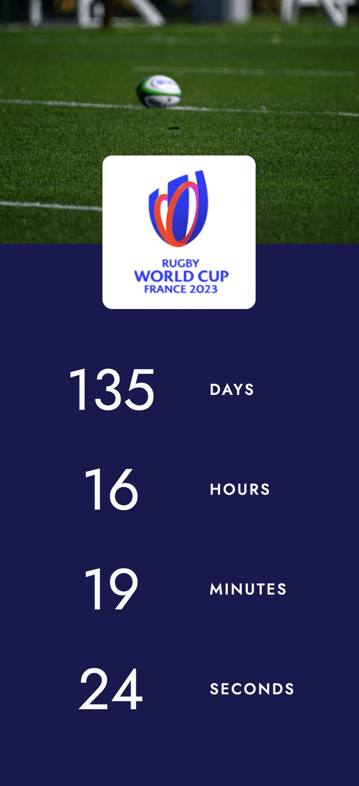

# RWC Countdown Timer with Vue CLI, Webpack and SASS

<div align="center">
  <picture>
    <source media="(max-width: 1199px)" srcset="./src/assets/countdown-mobile.png"/>
    <source media="(min-width: 1200px)" srcset="./src/assets/countdown-desktop.png"/>
    
  </picture>
  <p>Rugby World Cup Countdown Timer</br><em><small>(if viewing on desktop, resize the browser window to see the mobile version)</small></em></p>
</div>

</br>

## Table of contents

- [Overview](#overview)
  - [Links](#links) 
  - [Highlights](#highlights)
- [Build details](#build-details)
  - [Features](#features)
  - [What I learned](#what-i-learned)
- [Author](#author)

</br>

## Overview

For this project, I created a countdown timer using Vue CLI, Webpack and SASS. The timer counts down until the opening match (on 8 September) of Rugby World Cup 2023, which will be held in France from 8 September to 28 October.

My build needed to fulfill the following:

- mobile-first design
- creating a countdown based on today's date and the start date of Rugby World Cup

</br>

### Links

View live page: [Vue.js Countdown Timer](https://rileydevdzn.github.io/vue-rwc-countdown/)

</br>

### Highlights

- Mobile-first design
  - [Shifting layouts from mobile to desktop](#mobile-first-design)
- Creating a countdown
  - [Creating a countdown](#creating-a-countdown)

</br>

</br>

## Build details

### Features

#### *Mobile-first design*

For this project, I wanted to keep the focus on the countdown timer so I used a simple design with a photo of a rugby pitch and ball, along with matching the RWC color scheme. I also included a clickable icon that takes the user to the official Rugby World Cup 2023 website. 

I started with the mobile design, taking advantage of the vertical space to create a vertical stacked version of the countdown.

</br>

<div align="center">
  
  <p><em>Mobile version</em></p>
</div>

</br>

For the tablet design, with an increased viewport width, I shifted the layout to a horizontal side-by-side countdown with a minimalist boxed design.

</br>

<div align="center">
  
  <p><em>Tablet version</em></p>
</div>

</br>

For the desktop design, I overlaid the horizontal countdown timer over the photo of the rugby pitch and gave each category (days, hours, minutes, seconds) its own styled container.

</br> 

<div align="center">
  
  <p><em>Desktop version</em></p>
</div>

</br>


#### *Creating a countdown*


</br>


### What I learned

#### *JavaScript `date` object*


mention updatable end date instead of hardcoded 

</br>


#### *Using v-if with component load states*


I also included a v-else for when the timer reaches zero, with a simple "It's Time!" message and a link to the match schedule on the official RWC 2023 website.


</br>

## Author

- Riley - [View Portfolio](https://rileydevdzn.webflow.io)


<!--ORIGINAL README

# my-app

Tools

- Vue.js
- Webpack
- Babel
- ESLint

## Project setup
```
npm install
```

### Compiles and hot-reloads for development
```
npm run serve
```

### Compiles and minifies for production
```
npm run build
```

### Lints and fixes files
```
npm run lint
```

### Customize configuration
See [Configuration Reference](https://cli.vuejs.org/config/).

-->
